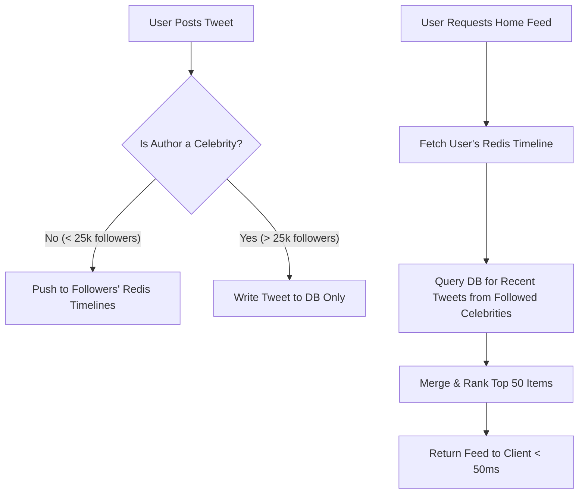

# System Design Case Study: Twitter News Feed & Timeline Architecture

Designing a massive-scale social timeline system capable of handling 500M+ DAU, 50,000+ tweet writes/sec, and sub-100ms personalized feed generation.

---

## 1. Requirements & Core Workflows

### Functional Requirements
1. **Post Tweet:** User can post a short text message with optional media attachments.
2. **User Timeline:** View all tweets posted by a specific user (reverse chronological).
3. **Home Timeline (News Feed):** View an aggregated feed composed of tweets from all users being followed.
4. **Follow / Unfollow:** Follow other user accounts.

### Non-Functional Requirements
* **Feed Latency:** $p99 < 100\text{ ms}$ for Home Timeline loading.
* **Eventual Consistency:** Acceptable for a tweet to appear in followers' feeds with a 1–2 second delay.
* **High Availability:** System must never reject tweet posts or fail feed fetches.

---

## 2. Capacity Estimations

* **Scale:** 500 Million Daily Active Users (DAU).
* **Tweets Posted:** 100M tweets/day $\approx \mathbf{1,200\text{ writes/sec}}$ (Peak: $5,000\text{ writes/sec}$).
* **Feed Reads:** Each user checks feed 5 times/day $= 2.5\text{ Billion feed reads/day} \approx \mathbf{30,000\text{ read QPS}}$.
* **Celebrity Outlier:** Lady Gaga / Elon Musk have 100M+ followers. Writing 1 tweet generates 100,000,000 feed insertions!

---

## 3. The Core Dilemma: Fan-out on Write vs. Fan-out on Read

```
┌────────────────────────────────────────┬────────────────────────────────────────┐
│     Fan-out on Write (Push Model)      │      Fan-out on Read (Pull Model)      │
├────────────────────────────────────────┼────────────────────────────────────────┤
│ When Alice tweets, system immediately  │ When Bob opens his app, system queries │
│ pushes the tweet ID into the Home      │ all people Bob follows, fetches their  │
│ Timeline Redis list of all followers.  │ recent tweets, and merges/sorts them.  │
│                                        │                                        │
│ ✅ Read latency is O(1) instantaneous! │ ✅ Writes are O(1) ultra-fast.         │
│ ❌ The "Celebrity Problem": Pushing to │ ❌ Read latency is slow; heavy O(NlogK)│
│ 100M followers halts background queue. │ multi-table database joins on query.   │
└────────────────────────────────────────┴────────────────────────────────────────┘
```

---

## 4. The Industry Standard Solution: Hybrid Fan-out Model



1. **Regular Users ($< 25,000$ followers):** Use **Fan-out on Write**. Push the tweet ID directly into each follower's pre-computed Redis cache list (`LPUSH user:timeline:bob tweet_id`).
2. **Celebrity Users ($> 25,000$ followers):** Do NOT fan out on write.
3. **Feed Generation at Read Time:**
   * Fetch the user's pre-computed Redis timeline ($O(1)$).
   * Concurrently query the recent tweets of the few celebrities the user follows.
   * Merge and rank the combined list in-memory in $< 10\text{ ms}$.

---

## 5. End-to-End System Architecture

```
                 [Mobile & Web Clients]
                            │
                            ▼
              [L7 Load Balancer / CDN]
                            │
         ┌──────────────────┴──────────────────┐
         ▼                                     ▼
   [Tweet Post API]                      [Feed Fetch API]
         │                                     │
         ├──► [Kafka / Message Queue]          ├──► [Redis Timeline Cache]
         │            │                        │    (Sorted Set: ZADD score=timestamp)
         │            ▼                        │
         │    [Fan-out Worker Pool]            ├──► [User Graph Service]
         │            │                        │    (Social Graph / Followers)
         ▼            ▼                        ▼
  [Tweet Storage (Cassandra / MySQL)] ◄─── [Social Graph DB (Neo4j / Redis)]
```

---

## 6. Redis In-Memory Timeline Storage

* Use Redis **Sorted Sets (`ZSET`)** for each user's home timeline:
  * **Key:** `timeline:user_id`
  * **Score:** `created_timestamp` (allows easy range queries by date/cursor)
  * **Value:** `tweet_id`
  * Keep only the latest 800 tweet IDs per active user. Truncate older items (`ZREMRANGEBYRANK timeline:user_id 0 -801`).
